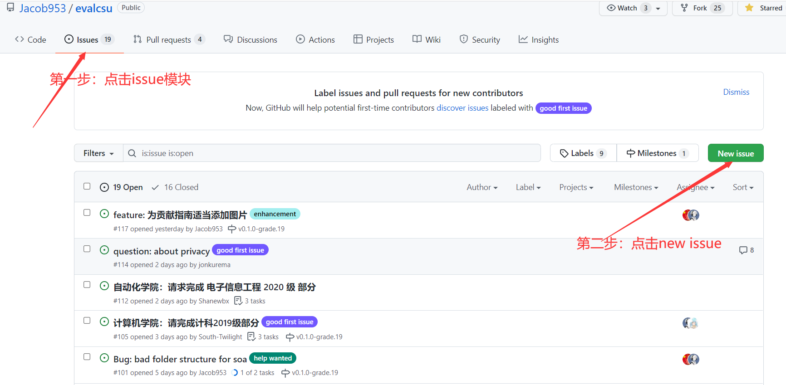
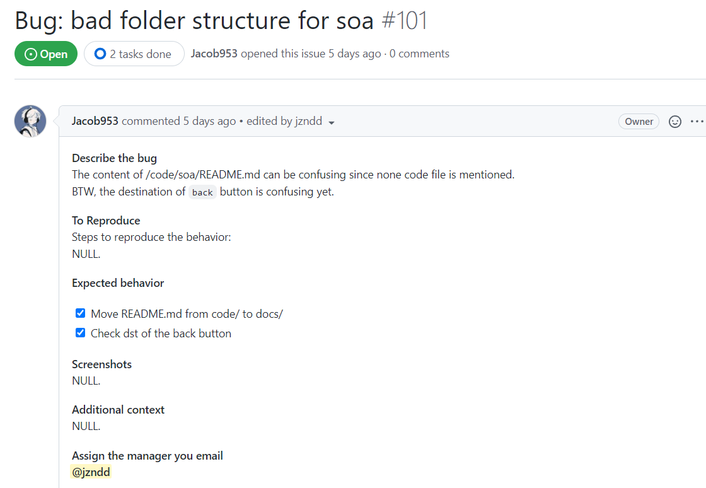
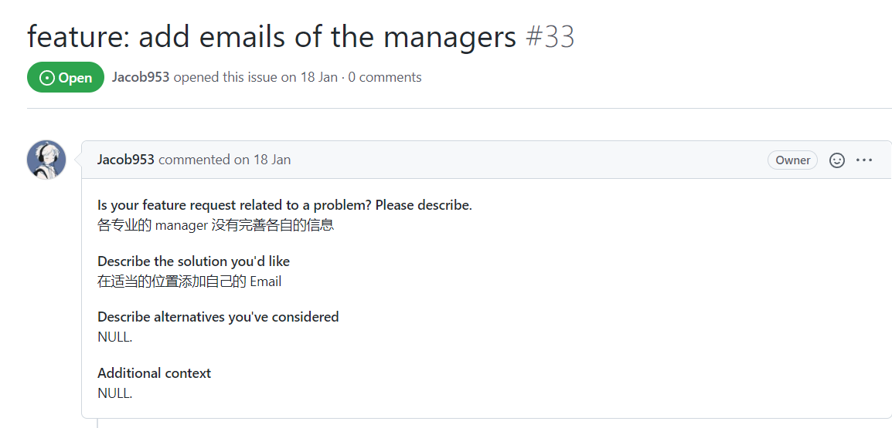
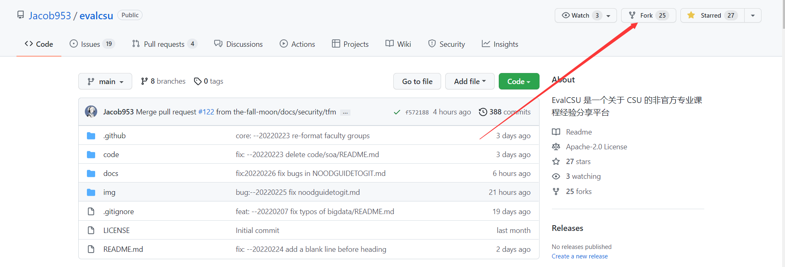
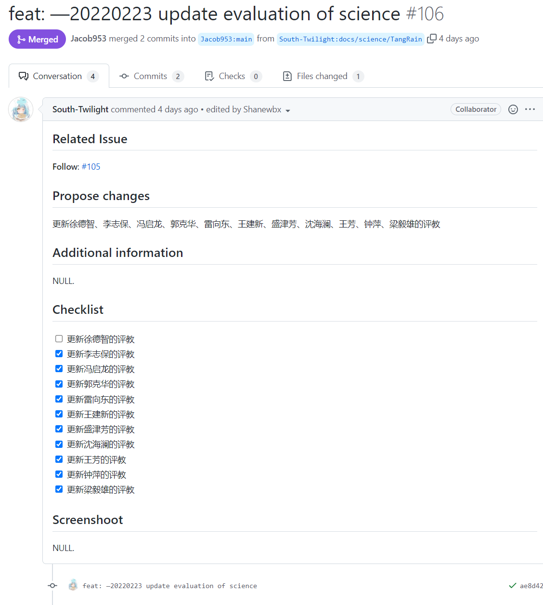

[> Back](../../../README.md#3.1-贡献准则)

[English](CONTRIBUTION.md) [繁體中文](CONTRIBUTION_zh_tradition.md)
## 为 EvalCSU 贡献

> **请确保你已经仔细阅读了本指南，在工作流程清晰后再进行操作!**
> 
> 我们欢迎任何形式的贡献，包括但不限于下列:
> 
> 1. 提出或申请并修正任何 EvalCSU 的内容错误 
> 2. 提出任何关于 EvalCSU 的疑惑和建议
> 3. 申请优化或新增课堂笔记、考点思维导图或实验课设
> 4. 申请参与课程、实验或老师的评教
> 5. 申请参与校级、院级或专业级经验分享
> 6. 将已有的内容翻译成其他语言
> 
> 若你是我们的协作者，请务必遵循 [Collaborator](#collaborator-协作者) 的要求
> 
> 若本指南有任何模糊不清的地方，请通过 Issue 和我们反映

- [为 EvalCSU 贡献](#为-evalcsu-贡献)
  - [Issue 模块](#issue-模块)
    - [新增 Issue](#新增-issue)
    - [Bug report 模版](#bug-report-模版)
    - [Evaluate request 模版](#evaluate-request-模版)
    - [Feature request 模版](#feature-request-模版)
  - [Pull Request 模块](#pull-request-模块)
    - [Pull Request 准备工作](#pull-request-准备工作)
    - [Pull Request 合并分支](#pull-request-合并分支)
  - [Collaborator 协作者](#collaborator-协作者)
    - [注意事项](#注意事项)
    - [Review 流程](#review-流程)
  - [EvalCSU 的 commit 注意事项](#evalcsu-的-commit-注意事项)

> 为了便于指导小白操作，我们将根据 GitHub 的操作模块进行详细指导
> 
> 尽管如此，我们还是建议你多参考已有的 Issue 或者 PR
> 
> 若你不是小白，可以参考一下几点：
> 1. 提交错误或建议等，请参考 [Bug report 模版](#bug-report-模版)
> 2. 提交评教或分享经验等，请参考 [Evaluate request 模版](#evaluate-request-模版)
> 3. 提交课设、笔记或作业等，请参考 [Feature request 模版](#feature-request-模版)

### Issue 模块
> Issue 是一种非常好的可沉淀的交流方式，能帮助 EvalCSU 实现答疑交流、反馈缺陷和提出新需求，欢迎你通过 Issue 与我们交流

提出新的 Issue 之前，请你检查 Open 和 Closed 中是否存在相似 Issue：
- 若 Open 中存在，且无法解决你的疑惑，请在该 Issue 下提出你的问题
- 若 Closed 中存在，但依然无法解决你的疑惑，可以重新新增一个 Issue
- 若都不存在，则在新增你的 Issue 

#### 新增 Issue

1. 进入 Issue 页面点击 `New issue` 按钮
   
   
   <p style="text-align: center">Figure 1. New issue 的按钮位置</p>
2. 选择 `Bug report`, `Evaluate request`, `Feature request` 或新建一个空白模版来初始化你的 Issue
   - Bug report：指出 EvalCSU 中存在的内容错误，并提出修正建议，详细请参考 [Bug report 模版](#bug-report-模版)
   - Evaluate request：向 Manager 提交评教、经验分享的申请，详细请参考 [Evaluate request 模版](#evaluate-request-模版)
   - Feature request：向 Manager 提交课堂笔记、考点思维导图或实验课设的优化或新增的申请，详细请参考 [Feature request 模版](#feature-request-模版)
3. 在禁止删除 **题目（加粗字体）** 的前提下，简述你的 Issue 内容，面对无法填写的部分，请以 `NULL.` 代替内容，而非删除题目
4. 修改标题中的 `<description>` 部分，建议参考已有 Issue
5. 点击 `Submit new issue` 按钮提交你的 Issue

#### Bug report 模版

> 仔细阅读 **题目（加粗字体）** ，尽可能保证 Bug 描述的简洁性和准确性

1. 在 **Describe the bug** 中简述 bug 的位置、影响以及可能带来的后果
   - 如果需要特殊步骤，在 **To Reproduce** 中描述复现 bug 的步骤
   - 如果不需要，则用 `NULL.` 代替
2. 在 **Expected behavior** 中简述你的解决方案或者你期待的效果
   - 为了使得描述更加具体，建议在 **Screenshots** 中贴上你的截图
   - 如果没有，则用 `NULL.` 代替
   - 如果有其他内容，则在 **Additional context** 中简述
   - 如果无其他内容， 填 `NULL.`
3. 在 **Assign the manager you email** 中 @ 负责 bug 所在区域的管理员


<p style="text-align: center">Figure 2. Bug issue 的按钮位置</p>

**特别注意**

- 通常情况下，Bug report 模版不需要 Email 管理员
- Bug report 模版中，你可以申请参与：
  1. 修正拼写、词语错误
  2. 修正课堂笔记错误
  3. 修正考点思维导图错误（考点更新不纳入修正范围）
  4. 修正实验课设错误
  5. 提出你的建议、疑惑
- 待管理员在该 Issue 下批准，便可移步 [Pull Request 模块](#pull-request-模块) 进行下一步操作。

#### Evaluate request 模版

1. 在提交 Issue 前，请到你所在的学院查询 **管理员** 表格
   - 若不存在对应学院，请重新申请 [Feature request](#feature-request-模版)
   - 若存在对应学院，请 Email 当前年级相近的管理员
2. 在 **Describe the evaluation you want to join** 中简述你希望参与的内容，务必包含年级、学院和模块（评教或经验分享）
3. 在 **Assign the manager you email** 中：
   - 如果未获得评教、经验分享资格，@ 所发邮件的管理员
   - 如果已获得评教、经验分享资格，填 `NULL.`

**特别注意**

- Evaluate request 模版中，你可以申请参与：
  1. 新增多个课程评教
  2. 新增多级经验分享
- 为了保护贡献者的隐私，Issue 和邮件中严禁出现个人信息
- 填写邮件内容时，请前往 `CSU 教务系统` -> `培养管理` -> `我的培养方案`，邮件内容附加全屏截图即可，建议包含系统时间
- 待管理员在该 Issue 下批准，便可移步 [Pull Request 模块](#pull-request-模块) 进行下一步操作。

#### Feature request 模版

1. 在提交 Issue 前，请到你所在的学院查询 **管理员** 表格
   - 若不存在对应学院，请优先 Email 一级 Reviewer(Rick Lin、jzndd)，同时在该 Issue 中申请添加对应学院
   - 若存在对应学院，请 Email 当前年级相近的管理员
2. 在 **Is your feature request related to a problem? Please describe.** 中简述你希望参与的内容，务必包含年级、学院和模块（课堂笔记、考点思维导图或实验课设）
3. 在 **Describe the solution you'd like** 中简述你的最优想法
   - 如果有代替方案，则在 **Describe alternatives you've considered** 中简述
   - 如果无代替方案， 填 `NULL.`
   - 如果有其他内容，则在 **Additional context** 中简述
   - 如果无其他内容， 填 `NULL.`
4. 无论是否有相应资格，都需要在 **Assign the manager you email** 中 @ 所发邮件的管理员


<p style="text-align: center">Figure 3. 优秀的 feature request 案例</p>

**特别注意**

- Feature request 模版中，你可以申请参与且不止于：
  1. 优化或新增多个课堂笔记
  2. 优化或新增多个考点思维导图
  3. 优化或新增多个实验课设
  4. 新增新的学院、专业
  5. 将已有内容翻译为其他语言
- 为了保护贡献者的隐私，Issue 和邮件中严禁出现个人信息
- 填写邮件内容时，请前往 `CSU 教务系统` -> `培养管理` -> `我的培养方案`，邮件内容附加全屏截图即可，建议包含系统时间
- 待管理员在该 Issue 下批准，便可移步 [Pull Request 模块](#pull-request-模块) 进行下一步操作。

### Pull Request 模块

> PR 即将你的贡献合并、发布到主仓库中
> 
> **任何 PR 都需要链接到已存在，并且已授权的 Issue**
> 
> 因此，在提交 PR 前，建议你优先阅读 [Issue 模块](#issue-模块)

#### Pull Request 准备工作

> 可以参考 [Git 新手指南](./NOOBGUIDTOGIT.md)

1. `fork` 主仓库到你的 GitHub 仓库中，并 `git clone` 个人仓库到本地
   
   
   <p style="text-align: center">Figure 4. fork 按钮位置</p>
2. 在本地新建一个分支
   - 分支命名规则：
      ```
      <type>/[faculty]/<your github id>/
      // e.g. docs/security/jacob953
      ```
    - git 命令示例：
      
      
      <p style="text-align: center">Figure 5. 新建分支的命令样例</p>
    - `<type>` 建议参考 [提交类型](#evalcsu-的-commit-注意事项)
3. 在本地新建的分支上完成你的修改，修改要求详细请参考 **项目搭建原则**
4. 在本地提交 commit 时，请严格遵循 [EvalCSU 的 commit 注意事项](#evalcsu-的-commit-注意事项)

**项目搭建原则**

- 文案排版请尽量参考 [中文文案排版指北](https://github.com/sparanoid/chinese-copywriting-guidelines/blob/master/README.zh-Hans.md)
- 禁止修改 .github 文件夹中的任何内容
- 根据提交的内容，可以更改项目目录结构，但不能修改三个主目录：
  - code：放置所有课设代码
  - docs：放置所有文档，包括：
    - evaluation：评教部分
    - faculty：学院、专业的笔记、考点导图、课设报告和经验分享部分
    - global：项目组织文档等
  - img：放置所有文档和代码中的图片
- 文件类型要求：
  - code 中不能放置压缩包类型文件，应展示代码结构
  - docs 中除实验指导书等内容固定的文件，不能放置 .docx, .pdf, .excl 等类型文件，应使用 .md 类型文件，便于更新和维护
- 文件、文件夹命名要求：
  - 禁止包含中文、特殊字符或空格
  - 需要简述文档、文件夹含义，而不是乱码
- 文件优化、新增要求：
  - 处理的文档有多个自然语言版本时，请将文件放入 global 中的对应文件夹下，目前仅支持: en, zh-simplify, zh-tradition
    - 应采用同一文件名，不需要添加解释性后缀
  - 处理的文档有多个编程语言版本时，请重新构建 code 目录，并按照语言分类
- 笔记、课设的优化、新增要求：
  - 禁止出现多版本笔记：
    - 若笔记已存在，则应在已有版本上进行迭代
    - 若笔记不存在，则应申请添加新笔记
  - 发生课改时，应在合适的 README.md 中做解释
- 评教、经验分享要求：
  - 措辞中肯，评价公正，遵守 [行为准则](../../../README.md#41-行为准则)

#### Pull Request 合并分支

1. 打开 GitHub，从个人仓库中选择 `New pull request` 按钮
  
  
  <p style="text-align: center">Figure 6. PR 按钮</p>
2. 选取本仓库的主分支与你修改过的分支作为比较对象，依照以下方式描述你的修改：
   1. 标题可以按照 `<type>[optional scope]: <description>` 的方式命名
   2. 在 **Related Issue** 中链接到相关 Issue，不可缺失
   3. 在 **Propose changes** 中简述你的改动，不可缺失
   4. 在 **Additional information** 中添加额外信息，可选
   5. 在 **Checklist** 中检查你的任务，不可缺失，但不要求一定完成
   6. 在 **Screenshoot** 中贴上对应截图
   
   
   <p style="text-align: center">Figure 7. 优秀的 PR 样例</p>
3. 点击 `Create pull request` 按钮创建你的合并请求

**特别注意**

- 禁止对本仓库的 gh-pages 进行任何操作
- 如果参与了评教（或经验分享）部分，请在 [EVALUATOR.md](../EVALUATOR.md) 中添加你的信息
  - 严禁出现个人信息，具有权威性即可

### Collaborator 协作者

#### 注意事项

1. 熟悉 [Issue 模块](#issue-模块) 和 [Pull Request 模块](#pull-request-模块) 中的所有流程
2. 禁止直接对主分支做任何操作
3. 积极维护平台环境环境，严格遵守 [贡献准则](../../../README.md#31-) 和 [行为准则](../../../README.md#41-)
4. 积极承担授权和审核的责任，完成授权和审核的工作
5. 积极承担 Review 的责任，完成 Review 工作

#### Review 流程

1. 进入需要 Rebiew 的 PR 页面，点击 `Files changed` 分页，查看其更改
2. 查看修改后，点击 `Review changes` 按钮，输入你的评论，并依照你的想法选择下列选项:
   1. Comment：不确定是否通过，只想提供建议
   2. Approve：通过修改
   3. Request changes：否定修改，需要再进行修改
3. 点击 `Submit review` 按钮提交个人的看法

**特别注意**

- 此过程为交叉互审，除 Jacob953(owner) 外，至少需要两名以上的协作者 Approved 后才能合并
### EvalCSU 的 commit 注意事项

1. 请尽量于本地进行 commit，有较大的操作空间与弹性。
2. 对于有关联的更改，请通过 `git commit` 记录，然后再一次性提交 PR。
3. 遵循以下的提交 commit 格式

```
<type>[optional scope]: <description>
```

**提交类型**
<div>
  <table margin="center">
    <thead>
        <tr>
            <th>type</th>
          	<th>description</th>
        </tr>
    </thead>
    <tbody>
        <tr>
            <td>feat</td>
            <td>新增新的功能</td>
        </tr>
      	<tr>
            <td>fix</td>
            <td>修正bug</td>
     		</tr>
     	 	<tr>
            <td>docs</td>
            <td>更新文档</td>
      	</tr>
      	<tr>
            <td>test</td>
            <td>新增或更新测试</td>
      	</tr>
      	<tr>
            <td>style</td>
            <td>格式化文档或代码</td>
      	</tr>
      	<tr>
            <td>chore</td>
            <td>其他提交类型</td>
      	</tr>
    </tbody>
  </table>
</div>